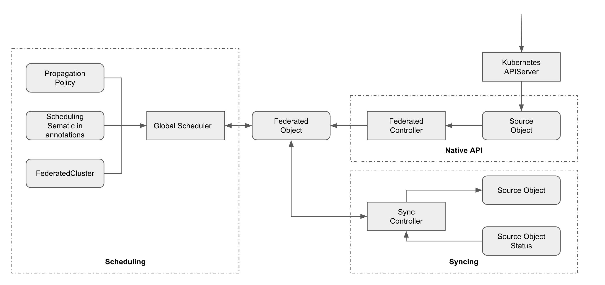

# KubeAdmiral - Enhanced Kubernetes Federation

[English](./README.md) | 简体中文

KubeAdmiral 是基于 [Kubernetes Federation v2](https://github.com/kubernetes-sigs/kubefed) 迭代演进而来，旨在提供云原生多云多集群的管理和应用分发能力。Kubernetes Federation v2 提供了 FederatedDeployment, FederatedReplicaSet, FederatedSecret 等部分资源，在调度上支持副本数调度，良好的支持无状态的 Deployment 应用；KubeAdmiral 在其基础上做了如下增强：

- 兼容原生 Kubernetes API。
- 提供更灵活的调度框架，支持丰富的调度分发策略。
- 差异化策略。
- 依赖调度/跟随调度。
- 提供状态收集的框架，提供更灵活的状态收集。
- 大规模实践下的功能和稳定性增强。

# 部署

KubeAdmiral 支持 Kubernetes 1.16-1.24 版本，更高或者更低的 Kubernetes 版本可能会导致兼容相关的问题，请参考 [Quickstart](./docs/quickstart.md) 完成部署 。

# 社区

## 贡献

若您期望成为 KubeAdmiral 的贡献者，请参考 [CONTRIBUTING](./CONTRIBUTING.md) 文档。

## 联系方式

如果您有任何疑问，欢迎提交 GitHub issues 或者 pull requests，或者联系我们的 [Maintainers](./MAINTAINERS.md)。

## 协议

KubeAdmiral 采用 Apache 2.0 协议，协议详情请参考 LICENSE，此外 KubeAdmiral 是在 Kubernetes Federation v2 代码基础上演进而来，还有一部分代码借鉴了 Kubernetes，原版权归属于 Kubernetes Authors；有些设计也参考了 [Karmada](https://github.com/karmada-io/karmada)，相关版权属于 Karmada Authors。
